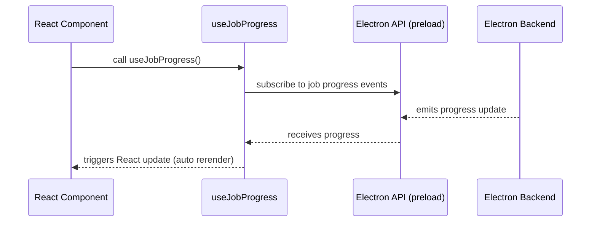

# Chapter 1: React/Electron Hooks and Integration

Welcome to your very first step into `wp-fotokopilot`! In this chapter, you'll discover how our app bridges the gap between React (the user interface) and Electron (the desktop environment) using *custom hooks*. Imagine these hooks as a pair of "walkie-talkies"—keeping your app's UI lively and up-to-date as things happen behind the scenes.

Let's get started!

---

## Why Do We Need React/Electron Hooks?

**Central Use Case:**  
Suppose you're scanning images. You want the UI to instantly show the scanning progress—without slow manual refreshes. How does your React component *know* that new items were scanned, or a job's progress just ticked up?

The answer: by using special hooks that listen for updates from Electron's backend. Whenever there’s a change—like a new scan result—your UI gets a "ping" and updates automatically.

---

## Key Concepts, Explained Simply

Let’s break down the magic behind the curtain:

### 1. **Electron API Preload Access**

This is how the React side talks to Electron’s backend. Think of it like picking up your walkie-talkie to talk to your friend in the other room.

### 2. **Subscribing to Events**

Hooks let you "listen in" and automatically react when certain things happen (like progress updates). Imagine your walkie-talkie squawks whenever there’s news!

---

## Solving the Use Case: Staying In Sync with Backend Events

Let's see how you might write a minimal React component to **display job progress** in real time.

### Example: Show Current Job Progress

```js
import { useJobProgress } from './hooks/useJobProgress'

function JobProgressDisplay() {
  const job = useJobProgress()
  if (!job) return <div>No job running</div>
  return <div>Progress: {job.percent}%</div>
}
```

This component always shows the *current* job’s progress, updating automatically as work happens in the backend. No manual polling or refresh required!

#### What's happening?
- `useJobProgress` is a **custom hook** that listens for job progress events.
- React re-renders your component whenever the job's status changes.

---

## More Examples: Reactively Updating UI With Scans

What if you want to see new scanned images show up as soon as they arrive?

```js
import { useScanProgress } from './hooks/useScanProgress'

function ScanWatcher() {
  useScanProgress() // updates internal app state on every new item
  // ...inside, read from store and display media
  return <div>Scanning in progress...</div>
}
```

- Just calling `useScanProgress()` subscribes your UI to real-time scan events.
- As new files are found, your app state is updated—showing a live experience!

---

## What Is a Custom Hook, Anyway?

A React **hook** is just a special function that lets you “hook into” extra behavior.  
Here, our custom hooks are *walkie-talkies* to Electron’s backend.

---

## How This Works Internally

Let’s peek under the hood—no code yet! Here’s how it flows with your example job progress:



### Step-by-step:
1. Your component *calls* `useJobProgress()`.
2. The hook subscribes to job progress events via the Electron API.
3. The backend emits a new progress update.
4. The hook hears the update and nudges React to redraw your UI.

---

## Simple Internal Implementation: How It’s Coded

Let’s see how these hooks are built.  
**Reminder:** Code here is kept extra simple for clarity!

### 1. Access the Electron API

```js
// useElectronAPI.js
export function useElectronAPI() {
  return window.electronAPI
}
```
*This just grabs the pre-exposed API so we can use backend features.*

### 2. Listen for Job Progress

```js
// useJobProgress.js
import { useEffect } from 'react'
import { useElectronAPI } from './useElectronAPI'

export function useJobProgress() {
  const api = useElectronAPI()
  useEffect(() => {
    const unsubscribe = api.job.onProgress((progress) => {
      // update your UI state here
    })
    return unsubscribe
  }, [api])
}
```

*Here, the hook subscribes to job events—with one tiny function!  
React’s `useEffect` sets up (and cleans up) the subscription for you.*

---

## Where to Learn More

- The main "walkie-talkie" magic is in [Electron IPC & Main Process Routing](02_electron_ipc___main_process_routing_.md)—covered in the **next** chapter!
- For storing and viewing app-wide state and updates, check [App Settings and State Management](03_app_settings_and_state_management_.md).

---

## Summary

In this chapter, you’ve learned:

- **Why** we use React/Electron hooks: for instant, automatic UI updates as backend events happen.
- **How** to use simple hooks to make your UI reactive (job progress or new scanned files!).
- **What’s under the hood:** hooks are walkie-talkies between your React UI and Electron.
- **Where** the code lives and how it’s organized.

Ready to dig deeper? Time to learn about how these events travel between Electron’s main and renderer processes:  
➡️ [Electron IPC & Main Process Routing](02_electron_ipc___main_process_routing_.md)

---

Generated by [AI Codebase Knowledge Builder](https://github.com/The-Pocket/Tutorial-Codebase-Knowledge)