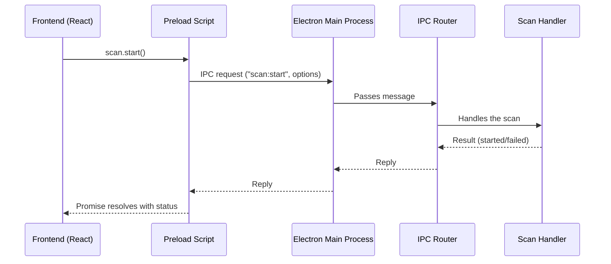

# Chapter 2: Electron IPC & Main Process Routing

Welcome back! In the [previous chapter](01_react_electron_hooks_and_integration_.md), you discovered how the React user interface talks to the Electron backend using hooks—like walkie-talkies between rooms. Now, let's peek behind the scenes to see **how** those walkie-talkie messages actually travel: through **Electron IPC** and the main process **routing**.

---

## Why Is Electron IPC Important?

**Imagine this story:**
You're using WP FotoKopilot. You click a button to start a media scan. But…  
- Where does your click actually go?
- How does the backend know what you want?
- How do you keep your computer safe from buggy or untrusted code in the UI?

The answer is **Electron IPC** (Inter-Process Communication)—like a secure helpdesk window where your UI (the "customer" side) pipes every request to the right department ("backend" experts).

**Central Use Case:**  
> “When I click 'Scan Now' in my app, I want the Node.js backend (main process) to handle the scan—and keep my UI separated and safe.”

---

## Key Concepts: The Nerve Center Explained

Let’s break down the magic:

### 1. **Renderer & Main: Two Separate Worlds**

- **Renderer:** Runs your React UI (think of it as your "front desk").
- **Main Process:** The Node.js powerhouse that does real work (like scanning files, talking to WordPress, etc.).

*They can't access each other's secrets directly.*

### 2. **IPC: The Secure Tunnel**

- **IPC = Inter-Process Communication**
- Acts like a mailbox: your UI drops off a request, the backend fetches it, does something useful, and sends back the results.

### 3. **Routing: Sorting Requests to the Right Team**

- The backend has different handlers ("departments") for every kind of action: job queues, scans, WordPress sites, etc.
- A router receives requests and delivers them to the correct handler.

### 4. **Validation: Keeping the Bad Guys Out**

- The router double-checks each request’s sender (*is it from our app?*) before acting.  
- Prevents mischief or confusion from untrusted sources.

---

## Use Case: Trigger a Scan From the Frontend

Let's see the flow:

**What happens when your React code wants to start a scan?**

```js
window.electronAPI.scan.start({ only:Images })
```

- The UI asks: “Hey backend, please scan for images.”
- The backend (main process) receives, validates, and routes that request.
- The `scan:start` handler does the work.

**Result:** Scanning starts! You’ll get progress updates via events (see [Chapter 1](01_react_electron_hooks_and_integration_.md)).

---

## Simple IPC Communication Example

**Front-End Call:**

```js
// In your React code
window.electronAPI.scan.start({ type: 'images' })
```

This asks the backend to kick off an image scan.

**What you see:**  
- If successful, scan progress starts updating in UI.
- Errors (like "device not found") arrive via a returned error.

**Why is this cool?**  
The UI stays "sandboxed" and safe.
The main process does the hard work.

---

## Internals: How Does IPC Routing Really Work?

Let’s walk through the steps—minus heavy code!



**In short:**  
Your scan request moves securely from UI → Preload → Main → Router → Scan Handler → and then bounces back with a result.

---

## “Under the Hood” Code (Step-by-Step)

### 1. **Preload Script: Safe Tunnel for IPC**

*File: `src/preload/index.cjs`*

```js
// Expose safe API in UI
contextBridge.exposeInMainWorld('electronAPI', {
  scan: {
    start: (options) => ipcRenderer.invoke('scan:start', options)
  }
  // ...other APIs
})
```

*What’s happening?*  
- Only exposes scan "start" method to front-end.
- Uses `ipcRenderer.invoke` for a secure, async request.

---

### 2. **Main Process Entry: Set Up IPC Router**

*File: `src/main/index.js`*

```js
// Set up router when app/window starts
registerIpcHandlers(mainWindow, ipcMain)
```

*What’s happening?*  
- Registers all “departments” (handlers) via the IPC router.
- Sets up Electron to listen for requests.

---

### 3. **Router: Route Requests & Validate Sender**

*File: `src/main/ipc/router.js`*

```js
export function registerIpcHandlers(mainWindow, ipcMain) {
  for (const { channel, handler } of allHandlers) {
    ipcMain.handle(channel, async (event, ...args) => {
      if (!validateSender(event)) throw new Error('Invalid sender')
      return handler(...args)
    })
  }
}
```

*What’s happening?*  
- For each channel (like 'scan:start'), the router listens for requests.
- Checks **who sent it**—only accepts if trusted (“our app”).
- Passes it to the right handler and replies.

---

### 4. **Scan Handler: Do the Work**

*File: e.g. `src/main/ipc/scan.handlers.js`*

```js
const scanHandlers = (mainWindow) => [{
  channel: 'scan:start',
  handler: (options) => {
    // Actually start a scan here!
    return { status: 'scanning' }
  }
}]
```

*What’s happening?*  
- Code responds to 'scan:start' requests.
- Kicks off scan, returns result (`{ status: 'scanning' }`).

---

## Analogy Corner: IPC is Like a Post Office!

- The **frontend** is the customer writing a letter (request).
- The **preload script** is the mailbox slot (safe tunnel).
- The **main process** is the sorting room.
- The **IPC router** is the postal clerk who sorts each letter by its destination (“scan” department, “jobs” department…).
- Each **handler** is like a proud local branch delivering the task!

---

## What About Security?

Before your “letter” is delivered, the clerk (router) checks the stamp to make sure it’s from someone trustworthy—so no spam requests get through.  
This keeps your app safe from rogue code or malicious plugins.

---

## Summary & Where Next?

You've learned:

- How **IPC** lets your React UI safely request backend work.
- How **routing** sends each request to the correct department (handler).
- How validation stops untrusted requests.
- How to trigger a real-world action (like a scan!) through a minimal code sample.
- Why Electron's IPC is the secret “helpdesk window” that keeps your app secure and organized!

Want to know what happens to actual app settings or the overall state?  
Let's dive deeper in [App Settings and State Management](03_app_settings_and_state_management_.md).

---

**Ready for more?**  
➡️ [App Settings and State Management](03_app_settings_and_state_management_.md)

---

Generated by [AI Codebase Knowledge Builder](https://github.com/The-Pocket/Tutorial-Codebase-Knowledge)