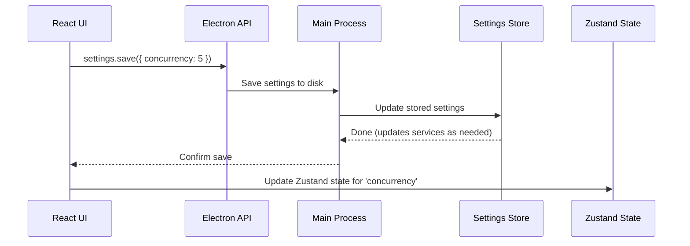

# Chapter 3: App Settings and State Management

Welcome back! In [Chapter 2: Electron IPC & Main Process Routing](02_electron_ipc___main_process_routing_.md), you learned how your app's UI can safely talk to the Electron backend—like sending requests through a secure helpdesk window. Now let's answer a new, vital question:

**How do we manage both user preferences (like “use this server!”), AND the ever-changing state of our dashboard (which site is selected? what images are in our list? which jobs are running?)?**

Short answer:  
We use **App Settings** (for persistent preferences) and **State Management** (for tracking the live status of your workspace)!

---

## Why Do We Need Both Settings *and* State?

Imagine you’re using WP FotoKopilot and:

- You want to set your favorite AI model once, and have it remembered next time you open the app.  
- You want to see which WordPress sites are connected, what media items you’ve scanned, and what jobs are in progress—just for your current session.

Both are essential!  
**Settings** are like your app’s “Preferences” window (sticky), while **state** is like an erasable whiteboard—synchronized but temporary.

---

## Central Use Case

Let’s say you want to:

1. Change the maximum number of jobs running at once (settings).
2. Scan a WordPress site, select a few images, and watch the list update live (state).
3. Have all these changes reflected immediately on your dashboard—and have your *settings* auto-remembered next time you open the app.

You'll now learn how this works!

---

## Key Concepts: An Overview

Here’s the big picture, made simple:

### 1. **App Settings: Sticky, Persistent Preferences**

- Stored in a small file on disk, even after you quit the app.
- Examples: Your “concurrency” (how many jobs at once), your AI model choice, or a server URL override.
- Managed *behind the scenes* so settings always sync with services that depend on them.

### 2. **App State: Live, In-Memory Dashboard**

- Managed only while the app is open.
- Tracks what’s on your screen: connected sites, image selections, job progress, etc.
- Managed using [Zustand](https://docs.pmnd.rs/zustand/getting-started/introduction) (a simple state library for React).

### 3. **Syncing Everything: Settings Feed State, State Reads Settings**

- When you change a setting, it syncs to disk—and updates in-memory dashboard too.
- Your dashboard (state) always reflects the current settings and the latest session info.

---

## Quick Analogy

Think of your *app settings* like the thermostat in your house:  
Set it once, and it remembers—no matter how many times you leave and come back!

Think of your *app state* like what's currently up on your fridge whiteboard:  
Filled with today’s reminders, names, tasks—but wiped clean when the day is over.

---

## Solving the Use Case: Step by Step

### 1. **Reading and Updating Settings (Persistent!)**

Suppose you want to change the default concurrency (jobs that run side by side).

**How to read the settings:**

```js
const settings = await window.electronAPI.settings.get()
// Example output: { concurrency: 3, copilotModel: 'gpt-4o', ... }
```
This gives you your app’s remembered choices.

**How to update a setting:**

```js
await window.electronAPI.settings.save({ concurrency: 5 })
```
Now your app will allow 5 jobs at once.  
*Next time you start the app, this preference sticks!*

---

### 2. **Managing "Live" State with Zustand (In-Memory!)**

Suppose you want to select a media item, or see the current job’s progress—just for this session.

**How to select a media item:**

```js
useAppStore.getState().toggleSelectItem(123) // 123 = media ID
```
Now media item 123 is highlighted/selected on your dashboard.

**How to read what's currently selected:**

```js
const selected = useAppStore.getState().selectedItems
// Example: [123, 124]
```
You can use this to trigger actions (like batch update alt text) on those items.

**How to show the list of WordPress sites:**

```js
const sites = useAppStore.getState().sites
// Example: [{id: 'site1', url: ...}, {id: 'site2', url: ...}]
```

---

### 3. **Keeping Everything in Sync**

When you update settings, Zustand’s live state is also updated to match (and vice versa for temporary dashboard changes).  
If settings like `concurrency` affect background services, those are also updated *behind the scenes* for you!

---

## Internal Walkthrough: What Happens Under the Hood?

Let’s visualize saving a new setting (like "use 5 jobs at once"):



**In summary:**  
A setting change is sent to the backend (where it’s saved) and any affected services (like job queues) are kept in sync. Your dashboard’s state is also updated, so your UI always shows the latest info.

---

## Code Under the Hood: File-by-File Breakdown

Let's see how this all connects. Don't worry—these are just *bite-sized* pieces!

---

### 1. **App Settings: Saving and Loading (Electron Main Process)**

*File: `src/main/services/settings-store.js`*

```js
import Store from 'electron-store'
const store = new Store({ name: 'wp-fotokopilot-settings' })

export async function getSettings() {
  return { ...DEFAULT_SETTINGS, ...store.get('settings', {}) }
}

export async function saveSettings(settings) {
  store.set('settings', { ...store.get('settings', {}), ...settings })
  // ...also update Copilot adapter, etc.
}
```
**Explanation:**  
- Settings are loaded by merging defaults with anything you’ve stored before.
- Updates are always written to disk and can also auto-update attached services.

---

### 2. **App State: Zustand Store (Renderer/React Side)**

*File: `src/renderer/stores/appStore.js`*

```js
import { create } from 'zustand'

export const useAppStore = create((set, get) => ({
  activeSiteId: undefined,
  sites: [],
  mediaItems: [],
  selectedItems: [],
  // ...more

  setSites: (sites) => set({ sites }),
  setMediaItems: (items) => set({ mediaItems: items }),
  toggleSelectItem: (id) =>
    set((state) => ({
      selectedItems: state.selectedItems.includes(id)
        ? state.selectedItems.filter((i) => i !== id)
        : [...state.selectedItems, id],
    })),
  setSettings: (settings) =>
    set((state) => ({ settings: { ...state.settings, ...settings } })),
}))
```
**Explanation:**  
- State changes are always in-memory for instant UI updates.
- For example, selecting or unselecting images is just a matter of updating the `selectedItems` array.
- Calling `setSettings()` ensures state and settings stay in sync.

---

### 3. **Syncing Settings from Backend to UI**

Your React UI typically loads settings when the app starts, and keeps the local state up-to-date:

```js
// On app start:
const settings = await window.electronAPI.settings.get()
useAppStore.getState().setSettings(settings)
```
**Explanation:**  
- No risk of UI getting “stuck”—it always loads the freshest settings at startup.

---

## A Quick Example: Full User Flow

**Scenario:** I want to scan images with my favorite settings, select a few, and start a new job.

1. User sets a setting:  
   → Saves to disk and syncs all services.

2. User scans:  
   → Images appear in state (`mediaItems`).

3. User selects images:  
   → Their IDs go into `selectedItems` for the session.

4. User starts a job:  
   → `currentJob` and progress update in realtime!

All state and settings flow between UI and backend, so what you see *is* what’s happening.

---

## Summary

- **App Settings** are your “sticky” preferences—saved and restored every launch.
- **App State** (with Zustand) is your live dashboard for the current session only.
- They sync to provide a smooth, always-in-step workflow.
- You’ve seen how code on both backend (settings) and frontend (state) work, and how they hook together for a seamless experience.

Now you can adjust preferences and manage live session state easily, knowing both are handled safely and in sync!

---

Ready to see how your secrets (like credentials) are kept safe and separate from state?  
Continue to [Secure Credential Storage (`credential-store.js`)](04_secure_credential_storage___credential_store_js___.md).

---

Generated by [AI Codebase Knowledge Builder](https://github.com/The-Pocket/Tutorial-Codebase-Knowledge)