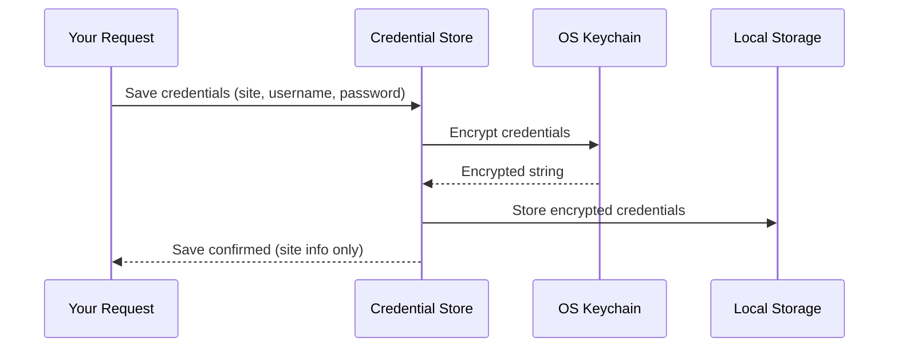

# Chapter 4: Secure Credential Storage (`credential-store.js`)

Welcome back! In [Chapter 3: App Settings and State Management](03_app_settings_and_state_management_.md), you learned how WP FotoKopilot saves your preferences and app state—making your dashboard lively and personalized.  
But what about your secrets, like passwords for your WordPress sites?  
Should they just sit in a settings file? Definitely **not**!

**This chapter is all about how WP FotoKopilot locks up your site credentials like a vault, using Secure Credential Storage (`credential-store.js`).**

---

## Why Secure Credential Storage Matters

Let’s start with a real-world example:
> Imagine you've connected 3 WordPress sites to FotoKopilot.
>
> Each connection needs a URL, your username, and an app password.  
> If these secrets are stored unprotected, anyone who opens your computer could see or steal them.

This is **not okay**!  
Passwords must be encrypted and saved in a way that *only FotoKopilot* can read them, and only *when needed*.

Think of Secure Credential Storage as a **lockbox** that:
- Encrypts your credentials using your computer’s built-in security system (the “keychain”).
- Never leaves secrets sitting around in plain text!
- Lets you safely access any connected site, only when you need it.

---

## Key Concepts (Explained Simply)

**Credential Store** helps you:
1. **Save Credentials Securely:**  
   When you connect a site, your username and password get locked up—never exposed, even if someone browses your files.

2. **Retrieve Secrets Only As Needed:**  
   Unlocks your credentials just before FotoKopilot talks to WordPress, and never keeps them out in the open.

3. **Keep Things Private:**  
   Only FotoKopilot can decrypt the vault. Other apps (or curious people) can't snoop!

4. **Delete Credentials Anytime:**  
   Remove site access, and your secrets disappear, too.

---

## Central Use Case

Let’s say you want to:

- Connect your WordPress site (`https://myblog.com`) with FotoKopilot, using a username and app password.
- Know for sure that your password is *never* stored unencrypted.
- Access your credentials when you need to upload images or run jobs.

Let’s walk through how you’ll do this!

---

## How to Use Credential Storage: Simple Examples

### 1. **Saving Site Credentials**

When you connect a new site, your credentials are encrypted and stored.

```js
await saveCredentials('site123', {
  url: 'https://myblog.com',
  username: 'admin',
  password: 'abcd1234',
  name: 'My Blog',
})
```
**What happens?**  
- The credentials are encrypted and stored securely.
- FotoKopilot remembers the site info, not the raw password.

---

### 2. **Retrieving Credentials For Access**

When you want to sync media from a site, FotoKopilot fetches your credentials—decrypting them *just in time*.

```js
const creds = await getCredentials('site123')
// creds = { id, url, username, password, name, capabilities }
```
**What happens?**  
- Your password is decrypted just for this request.
- FotoKopilot uses it to talk to your site—then keeps it safe again.

---

### 3. **Listing All Connected Sites (Without Passwords!)**

Need a list of all sites, but not the secrets?

```js
const sites = await listSites()
// sites = [{id, name, url, capabilities}, ...]
```
**What happens?**  
- Only site info returned—no passwords!

---

### 4. **Deleting Credentials for a Site**

Want to remove a site from FotoKopilot (and make the secrets vanish)?

```js
await deleteCredentials('site123')
```
**What happens?**  
- All credentials for this site are deleted from secure storage.
- No one can access this site unless you re-add it.

---

## How Does Secure Credential Storage Work?

Let’s peek *inside the vault*—without worrying about code details yet.

Here’s what happens when you save your credentials:



**Step-by-step:**
- Your request comes in with credentials.
- The store asks your operating system ("Safe"/Keychain) to encrypt them.
- The encrypted string is stored in DB (electron-store).
- FotoKopilot confirms, but only returns general info (not secrets).

When you need them again, FotoKopilot:
- Reads the encrypted entry.
- Asks the Keychain to decrypt.
- Uses the secret just in time.

---

## Internal Implementation: Minimal, File-By-File

All logic lives in:  
**`src/main/services/credential-store.js`**

Let’s look at the three main actions—keeping each code block *very small*.

---

### 1. Saving Credentials

```js
import { safeStorage } from 'electron'
import Store from 'electron-store'

export async function saveCredentials(siteId, creds) {
  const encrypted = safeStorage.encryptString(JSON.stringify(creds))
  const sites = store.get('sites', {})
  sites[siteId] = { id: siteId, credentials: encrypted.toString('base64') }
  store.set('sites', sites)
}
```
**Explanation:**  
- Uses Electron's built-in encryption (`safeStorage`).
- Credentials converted to a string, encrypted, and saved as unreadable data!

---

### 2. Retrieving Credentials

```js
export async function getCredentials(siteId) {
  const sites = store.get('sites', {})
  const data = sites[siteId]
  if (!data) return undefined
  const decrypted = safeStorage.decryptString(Buffer.from(data.credentials, 'base64'))
  return JSON.parse(decrypted)
}
```
**Explanation:**  
- Finds the site’s encrypted blob.
- Decrypts it using your OS (not FotoKopilot logic!).
- Returns your secrets, but ONLY to the app, and only when needed.

---

### 3. Deleting Credentials

```js
export async function deleteCredentials(siteId) {
  const sites = store.get('sites', {})
  delete sites[siteId]
  store.set('sites', sites)
}
```
**Explanation:**  
- Simply deletes the site's entry.
- After deletion, those credentials are gone forever (unless you re-add)!

---

## Why Is This So Safe?

Think of an actual **locked vault** in your house:
- Only you have the key (your OS keychain).
- Even if someone finds the locked box, they can't open it.
- FotoKopilot never keeps credentials lying around in memory for longer than needed.
- If your OS doesn't support encryption, FotoKopilot warns you—never falls back to unsafe methods!

> **Compared to regular settings:**  
> Credentials are *never* mixed with normal preferences, and are *always* encrypted!

---

## Transition: Working with Credentials and APIs

Now that you know how your site secrets are guarded inside the vault, you’re ready for the next step:
**Actually talking to WordPress—using these credentials securely!**

The next chapter will show you how WP FotoKopilot talks to WordPress using its own REST API client.

---

## Summary

- WP FotoKopilot stores WordPress site credentials using encrypted Secure Credential Storage.
- Your secrets are never exposed; only decrypted when needed—just-in-time for site access.
- Credentials are handled by your OS keychain and kept separate from app settings and state.
- You can save, retrieve, list, and delete credentials safely, with beginner-friendly code.

Ready to see how FotoKopilot uses these credentials to connect to WordPress sites and manage your content?

➡️ Continue to [WordPress REST API Client (`wp-client.js`)](05_wordpress_rest_api_client___wp_client_js___.md)

---

Generated by [AI Codebase Knowledge Builder](https://github.com/The-Pocket/Tutorial-Codebase-Knowledge)