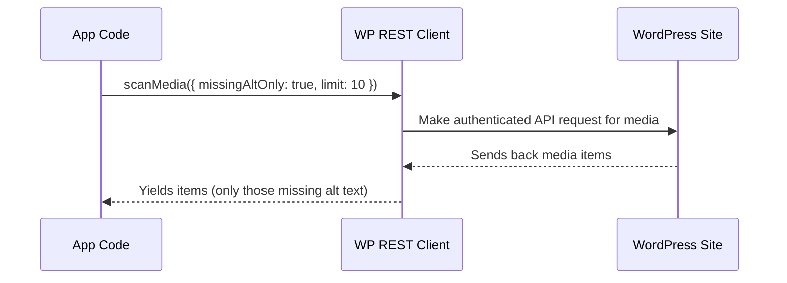

# Chapter 5: WordPress REST API Client (`wp-client.js`)

Welcome back! In [Chapter 4: Secure Credential Storage (`credential-store.js`)](04_secure_credential_storage___credential_store_js___.md), you learned how WP FotoKopilot keeps your WordPress site logins locked up and safe.  
Now, let's answer an exciting question: **How does FotoKopilot actually talk to your WordPress site, fetch your images, update alt text, and install plugins—using those secure credentials?**

The answer: **The WordPress REST API Client (`wp-client.js`)!**

---

## Why Do We Need a WordPress REST API Client?

Imagine you want to **scan your WordPress site's media library**, or maybe **update image alt text** from right inside FotoKopilot.  
You could try clicking hundreds of buttons in your browser... but wouldn't it be better if the app could do all that for you with just a click?

**Central Use Case:**  
> "I want FotoKopilot to list my site's images so I can quickly update their alt text. The app should handle all the technical talk—like authentication and REST API quirks—without me worrying about it."

That's what the WordPress REST API Client does! It acts like your *bilingual, tech-savvy assistant*—handling communication with any WordPress site, even if those sites are picky or speak slightly different 'accents' of the API.

---

## Key Concepts: What Does `wp-client.js` Do?

Let's break down the magic—one simple idea at a time:

1. **Makes Authenticated Requests for You**  
   - Remembers your credentials (from the secure store!) and uses them safely in every request.

2. **Fetches and Scans Media**  
   - Can list (scan) all your site's images.  
   - Optionally finds only images *missing* alt text.

3. **Updates Alt Text**  
   - Can update the alt text for any image on your site.

4. **Checks Site Info and Language**  
   - Finds out what language your site uses, and if extra features (like Virtual Media Folders) are available.

5. **Installs/Manages Plugins**  
   - Can install or activate plugins (like VMF) directly.

6. **Handles API Quirks for You**  
   - Deals with things like rate limiting ("too many requests") or weird error codes behind the scenes.

---

## How to Use the REST API Client: Solving the Use Case

Ready to see this in action?  
Let's walk through a simple example: **Listing images on your WordPress site.**

Let's assume you've already chosen a site and have its credentials (from [Chapter 4](04_secure_credential_storage___credential_store_js___.md)).

### 1. **Create a Client for Your Site**

```js
import { createWpClient } from './services/wp-client.js'

const client = createWpClient({
  url: 'https://myblog.com',
  username: 'admin',
  password: 'abcd1234',
})
```
*This sets up a helper that knows how to "speak WordPress" for your site.*

---

### 2. **Scan Images in the Media Library**

```js
const images = []
for await (const img of client.scanMedia({ missingAltOnly: true, limit: 10 })) {
  images.push(img)
}
```
- This fetches up to 10 images that *don't have* alt text.
- Each `img` contains info like its ID, URL, and current alt text.

---

### 3. **Update the Alt Text for an Image**

```js
await client.updateAltText(123, 'A beautiful sunset')
```
- This tells WordPress: "For image #123, set the alt text to 'A beautiful sunset'."
- The app takes care of making the right, safe request.

---

### 4. **Check if the Site Has VMF (Virtual Media Folders)**

```js
const info = await client.testConnection()
console.log(info.capabilities) // { rest: true, vmf: true }
```
- You can see if extra features are installed or available.

---

### 5. **Install a Plugin (like VMF)**

```js
await client.installPlugin('virtual-media-folders')
```
- Installs and activates the plugin (if you have permissions).
- Handles complexities automatically—like what if the plugin is already there?

---

### What do you get back?  
- Most methods return convenient objects (like media items, or plugin status), or just `undefined` if the action succeeded.
- If there's an error (like wrong password or site trouble), the client will throw a clear error message.

---

## Under the Hood: How Does `wp-client.js` Work?

Let's break down the magic into a simple story.

Suppose you want to scan for images missing alt text:



#### What happens step-by-step?

1. **You ask the client** for images missing alt text.
2. **The client** builds and sends HTTP requests to your site's REST API, including your credentials in a safe way.
3. **WordPress** replies with a list of images.
4. **The client** filters out images that *already have* alt text, then hands the rest back to you—one-by-one!

_Note: If the API returns an error (like "access denied"), the client will raise a clear error, so you know what went wrong._

---

## A Peek Into the Code: What Are the Main Parts?

All code lives in:  
`src/main/services/wp-client.js`

Let's break down the key actions into mini code blocks.

---

### 1. **Creating the Client**

```js
export function createWpClient({ url, username, password }) {
  // code that remembers credentials and can make requests
  // ...
  return { /* methods go here */ }
}
```
- You give it your site info and password, and it gives you a bundle of methods to interact with that site.

---

### 2. **Making a Safe API Request**

```js
async function request(endpoint, options = {}) {
  // Add credentials to the request header
  const response = await fetch(fullUrl, {
    ...options,
    headers: {
      Authorization: /* your credentials */,
      // ...
    },
  })
  if (!response.ok) throw new Error('Something went wrong')
  return await response.json()
}
```
- Every WordPress API call is made using your saved credentials, but the app hides this complexity for you.
- It automatically handles common errors (like "Rate limited" or "Unauthorized").

---

### 3. **Scanning Media for Images**

```js
async *scanMedia({ missingAltOnly, limit }) {
  // For each image from WordPress:
  //   yield it if it's missing alt text
}
```
- The client uses WordPress API's `/wp/v2/media` endpoint in the background.
- You just receive image objects, one-by-one.

---

### 4. **Updating Alt Text**

```js
async function updateAltText(mediaId, altText) {
  // Makes a POST request to /wp/v2/media/{id}
}
```
- Updates the alt text in a single API call.

---

### 5. **Installing or Activating Plugins**

```js
async function installPlugin(slug) {
  // POST to /wp/v2/plugins to install and activate by slug
}
```
- Deals with the tricky bits for you (like activating plugins that are already installed).

---

## How Does This Connect With Other Parts of the App?

- **Gets Credentials from Secure Store:**  
  The client doesn't store passwords itself—it asks the [Secure Credential Storage](04_secure_credential_storage___credential_store_js___.md) when it needs them.

- **Used by Scan and Site Handlers:**  
  For example, when FotoKopilot scans your library or installs a plugin, it uses the REST API client under the hood:
  - See [`scanHandlers`](src/main/ipc/scan.handlers.js)
  - See [`siteHandlers`](src/main/ipc/site.handlers.js)

- **State and Settings:**  
  Results from the API (like images or plugin capabilities) are stored in the [App State](03_app_settings_and_state_management_.md) for your UI to show to you.

---

## Analogy Corner: Your Bilingual Messenger

Think of `wp-client.js` as your **trusted messenger who speaks WordPress API fluently**:

- You tell it what you want ("fetch images without alt text", "update this photo's info").
- It makes sure all your requests are properly addressed, come with ID, and use the right language.
- If the door is locked, it tells you exactly why, so you can fix it!

---

## Summary

- The **WordPress REST API Client** is FotoKopilot's secret helper for talking to any WordPress site, handling details like authentication, finding images, updating alt text, and managing plugins.
- You use it by "creating" a client for your site, then calling simple methods (like `scanMedia` or `installPlugin`).
- It handles all the technical RPC and HTTP details, so you don't have to!
- This client works together with the [Secure Credential Store](04_secure_credential_storage___credential_store_js__

---

Generated by [AI Codebase Knowledge Builder](https://github.com/The-Pocket/Tutorial-Codebase-Knowledge)