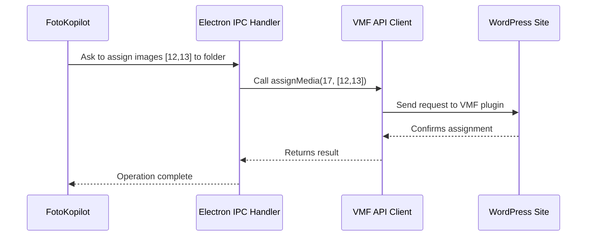

# Chapter 6: Virtual Media Folders (VMF) Integration

Welcome back! In the last chapter, [WordPress REST API Client (`wp-client.js`)](05_wordpress_rest_api_client___wp_client_js___.md), you learned how WP FotoKopilot talks to your WordPress site and works with images. Now, let's unlock a *superpower* for anyone with lots of media: **organizing images into folders** right in WordPress using the Virtual Media Folders (VMF) system!

---

## Why Virtual Media Folders? — Motivation & Use Case

**Central Use Case:**  
> "I have hundreds of images on my WordPress site. It’s a mess! I want to organize them into folders like 'Events/2024', 'Products/Shoes', or even create a brand-new folder tree. And I want FotoKopilot to help me put each photo in the right folder—all in just a few clicks!"

Most WordPress sites simply list files in one long stream. Finding and sorting photos can be overwhelming, especially as your site grows. VMF solves this:  
**You can create folders, build hierarchies, and sort images with the ease of a file manager!**

---

## Key Concepts — Understanding VMF Step-By-Step

Let’s explore the main ideas behind VMF like you’re a warehouse organizer:

### 1. **Folders and Hierarchies**

- A *folder* holds media (images).
- Folders can be *nested* inside other folders (like "Events / 2024 / January").
- You can build as many layers as you like—just like organizing shelves!

### 2. **Assigning Images to Folders**

- You can *assign* any image to a folder—think of placing a box (photo) on the right shelf.

### 3. **Creating New Folders on Demand**

- Need a new category? Just create a folder!
- You can even make a whole new path ("Products/New Release/Spring")—FotoKopilot will build it for you, step-by-step.

### 4. **Finding Ungrouped Images**

- Not sure what’s left out? VMF lets you list all *uncategorized* images—photos not yet sorted into folders.

### 5. **Syncs Directly With WordPress and VMF Plugin**

- Everything works via the [VMF WordPress plugin](https://wordpress.org/plugins/virtual-media-folders/) and talks to WordPress behind the scenes.
- FotoKopilot uses the VMF API to make everything feel instant and safe.

---

## How To Organize Your Media — Minimal Examples

Let's walk through a *real-world workflow!* All actions are super simple—with code you can copy or trigger via the app.

### ❶ List All Folders On the Site

```js
const folders = await vmfClient.listFolders()
// Output: [
//   { id: 1, name: "Events", children: [...] },
//   { id: 2, name: "Products", children: [...] },
// ]
```
*You’ll get a tree of folders, ready to explore or display.*

---

### ❷ Create a New Folder

```js
const folder = await vmfClient.createFolder("Spring 2024", parentId)
// Output: { id: 17, name: "Spring 2024", parentId: 2 }
```
*Creates a folder called "Spring 2024" inside a parent folder (like "Products").*

---

### ❸ Create a Nested Folder Path (Auto-Builds Missing Parents)

```js
const deepest = await vmfClient.createFolderPath("Events/2024/June")
// Output: { id: ... }
```
*If "Events" or "2024" don’t exist, FotoKopilot creates them for you!*

---

### ❹ Assign Images to a Folder

```js
const result = await vmfClient.assignMedia(folderId, [12, 13])
// Output: [{...}, {...}]
```
*Photos #12 and #13 are now in your chosen folder.*

---

### ❺ List All Uncategorized Images

```js
const uncategorized = await vmfClient.getUncategorizedMedia(10)
// Output: [{ id: 22, filename: "DSC01234.jpg", ... }, ...]
```
*Up to 10 images with no folder—great for cleanup!*

---

## How Does VMF Integration Work Internally? — Step-by-Step Flow

Here’s a simple breakdown using a warehouse analogy and a diagram!

**Imagine:**  
You (the app) want to assign images to a folder.



- The App sends a request through the IPC system.
- The VMF Client bundles everything up and talks to WordPress (via the VMF plugin).
- The site processes and confirms the operation, and the result comes all the way back for you to see.

---

## Code Under The Hood — A Friendly Peek

All integration magic lives in two key files:  
- `src/main/ipc/vmf.handlers.js` (routes requests between app and VMF)
- `src/main/services/vmf-client.js` (talks directly to the VMF API)

Let’s look at each core part, **step by step**.

---

### Listing Folders (Handler + Client)

**Handler:**
```js
// In vmf.handlers.js
{
  channel: 'vmf:list',
  async handler({ siteId }) {
    const client = await getVmfClient(siteId)
    return client.listFolders()
  }
}
```
*When the app wants to list folders, it calls this handler, which creates a VMF client and gets the full tree.*

---

**Client:**
```js
// In vmf-client.js
async function listFolders() {
  const folders = await request('/folders')
  return buildFolderTree(folders)
}
```
*Makes a simple API call and organizes folders into a neat hierarchy.*

---

### Creating a Folder Path

**Handler:**
```js
// In vmf.handlers.js
{
  channel: 'vmf:createPath',
  async handler({ siteId, path }) {
    const client = await getVmfClient(siteId)
    return client.createFolderPath(path)
  }
}
```
*Directs the request to the right site and builds the folder path for you.*

---

**Client:**
```js
// In vmf-client.js
async function createFolderPath(path) {
  // For each folder in 'Events/2024/May':
  //   If not found, create it!
}
```
*Automatically walks down the path, creating missing folders one by one.*

---

### Assigning Media to Folders

**Handler:**
```js
// In vmf.handlers.js
{
  channel: 'vmf:assign',
  async handler({ siteId, folderId, mediaIds }) {
    const client = await getVmfClient(siteId)
    return client.assignMedia(folderId, mediaIds)
  }
}
```
*Handles the job of placing images into the right folder.*

---

**Client:**
```js
// In vmf-client.js
async function assignMedia(folderId, mediaIds) {
  for (const id of mediaIds) {
    await request(`/folders/${folderId}/media`, {
      method: 'POST',
      body: JSON.stringify({ media_id: id }),
    })
  }
}
```
*Sends each image to its folder, one-by-one, using the VMF API.*

---

### Finding Uncategorized Images

If VMF’s plugin has a fast "uncategorized" endpoint, FotoKopilot uses it:

```js
// In vmf-client.js
async function getUncategorizedMedia(limit) {
  const items = await request(`/media/uncategorized?per_page=${limit}`)
  return items.map(item => ({
    id: item.id,
    filename: item.slug,
    // ... other fields
  }))
}
```
*Bundles up the least-organized items, ready for you to sort or edit.*

If that endpoint isn’t available, FotoKopilot falls back to checking each image and its folder assignments by inspecting *taxonomy terms* via the WordPress API (see handler comments for details).

---

## How VMF Connects to Other FotoKopilot Features

- **Credentials:** Uses secure site credentials from [Secure Credential Storage (`credential-store.js`)](04_secure_credential_storage___credential_store_js___.md).
- **WordPress API:** Works together with [WordPress REST API Client (`wp-client.js`)](05_wordpress_rest_api_client___wp_client_js___.md) for deeper features.
- **App State:** All folders and assignments sync up with your dashboard, powered by [App Settings and State Management](03_app_settings_and_state_management_.md).
- **Jobs & Queues:** Folder reorganization and assignments are tracked in [Job Processing & Queue (`job-queue.js`)](07_job_processing___queue___job_queue_js__.md)… coming up next!

---

## Recap & Next Steps

**You’ve learned:**

- Why Virtual Media Folders make organizing images fun and easy—even on huge WordPress sites.
- Key concepts: folders, hierarchies

---

Generated by [AI Codebase Knowledge Builder](https://github.com/The-Pocket/Tutorial-Codebase-Knowledge)