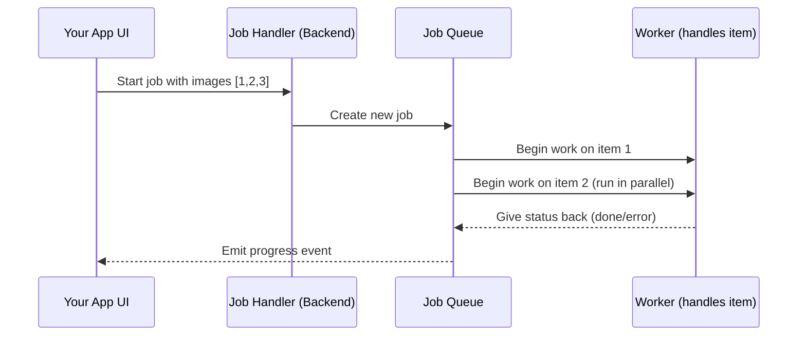

# Chapter 7: Job Processing & Queue (`job-queue.js`)

Welcome back! In [Chapter 6: Virtual Media Folders (VMF) Integration](06_virtual_media_folders__vmf__integration_.md), you learned how WP FotoKopilot helps you organize huge libraries of images into folders on your WordPress site.

But what if you want to **run a big batch of tasks**—like generating alt text for 200 images, or updating 100 photos with new info? Doing every task one-by-one, by hand, would be exhausting—and could make your computer (or your server) slow. That’s where **Job Processing & Queues** come in!

---

## Motivation: Why We Need a Job Queue

**Central Use Case:**  
> “I want to select dozens (or hundreds!) of images, then generate new alt text for them in a single click. But I don’t want my computer or WordPress to freeze or overload. I want to see progress, handle any errors, pause if I need to, and even retry failures, all automatically!”

Imagine a factory:  
- Photos come down a conveyor belt.
- Several workers (not just one!) can work in parallel, but not too many—otherwise, chaos.
- If anything goes wrong, there’s a way to stop, fix, or retry.

**A ‘job queue’ is the conveyor belt and traffic manager for your batch jobs!**

---

## Key Concepts — The Job Queue, Step by Step

Let’s break down how this works—one simple idea at a time.

### 1. **Jobs**

A *job* means “a big batch of similar tasks” with a goal.  
Example: “Generate alt text for these 100 images.”

### 2. **Items**

Each job has *items*—the things you want to process (like each photo).

### 3. **Concurrency (Workers in Parallel)**

We use a safe number of “workers” at a time (e.g., 3 at once), so your system is never overloaded.  
You can think of this as having 3 factory workers on the line, not 100 all at once.

### 4. **Retries**

If something fails (like a network hiccup), items are retried a few times—so temporary issues don’t stop everything forever.

### 5. **Progress Tracking**

You can see:
- How many items are done
- How many failed or are still running
- The status of each item (pending, processing, completed, failed)

### 6. **Pausing, Resuming, and Cancelling**

You can **pause**, **resume**, or **cancel** jobs anytime—great for taking a break or making changes without losing your place.

---

## How to Use the Job Queue — Solving a Usual Case

Let’s see how easy this is in practice!

### Example: Generate Alt Text for a Batch of Images

**Step 1: Start the Job**

```js
const { jobId } = await window.electronAPI.job.start({
  type: "generate",
  siteId: "mysite",
  items: [{ id: 1 }, { id: 2 }, { id: 3 }], // your selected images
  options: { withFolders: false }
})
```

*What happens?*  
- A new job starts, processing each image—only a few at a time!
- Returns a `jobId` so you can track progress.

---

**Step 2: Track Progress (Reactive UI)**

Use a hook in your React UI (see [Chapter 1: React/Electron Hooks and Integration](01_react_electron_hooks_and_integration_.md)):

```js
const progress = useJobProgress(jobId)
// Example progress object: { total: 3, completed: 2, failed: 0, items: [...] }
```

*What happens?*  
- Your UI updates automatically as images are processed!

---

**Step 3: Pause, Resume, or Cancel the Job**

```js
await window.electronAPI.job.pause(jobId)   // Pauses the conveyor belt
await window.electronAPI.job.resume(jobId)  // Resumes after a pause
await window.electronAPI.job.cancel(jobId)  // Cancels the whole job
```

*What happens?*  
- The queue will stop, wait, or abandon the job—your choice!

---

**Step 4: Export the Results**

```js
const csv = await window.electronAPI.job.export({ jobId, format: "csv" })
// Get a CSV or JSON file with results and errors!
```

---

## What Does the Output Look Like?

You’ll see (in your dashboard):
- A total count (“100 images in queue”)
- Progress (“27 completed, 2 failed, 71 left”)
- Each item’s status and any errors (like “image not accessible”)

---

## Under the Hood: What Happens Step-by-Step?

Let’s see a simple *story version* of what happens when a job is started:



- The UI requests a job (with items) via safe backend code.
- The backend job handler asks the **JobQueue** to create and run the job.
- The queue only allows a few items to be processed in parallel.
- Workers (functions) do the work (e.g., “generate alt”) for each item.
- As items finish, the queue sends progress updates back to the UI.

---

## A Look at the Code — File By File (Simplified!)

All the magic happens in two places:
- `src/main/services/job-queue.js` (the factory/conveyor belt)
- `src/main/ipc/job.handlers.js` (connects your UI requests to the queue)

Let’s look at super-simple versions of each part.

---

### 1. **Creating and Starting a Job**

**job.handlers.js**
```js
const job = jobQueue.createJob(jobId, items, handler)
jobQueue.start(jobId)
```
*This sets up your job and starts processing it.*

- `createJob` – sets up all the items to be handled.
- `start` – puts items into motion with the resume/pause/cancel logic.

---

### 2. **How Each Item is Processed**

**job-queue.js**
```js
async processItem(job, item) {
  item.status = 'processing'
  try {
    item.result = await job.handler(item)
    item.status = 'completed'
  } catch (err) {
    if (item.attempts < this.maxRetries) {
      item.status = 'retry'
      // Wait and try again later
    } else {
      item.status = 'failed'
    }
  }
  this.emitProgress(job)
}
```
*Each photo is processed with error handling and retry if needed.*

---

### 3. **Handling Pause, Resume, and Cancel**

**job-queue.js**
```js
pause(jobId) {
  job.paused = true
}
resume(jobId) {
  job.paused = false
}
cancel(jobId) {
  job.cancelled = true
}
```
*You can control the job queue like a real conveyor belt—stop, start, or shut down anytime.*

---

### 4. **Emitting Progress Updates**

**job-queue.js**
```js
emitProgress(job) {
  this.emit('job:progress', {
    jobId: job.id,
    total: job.total,
    completed: job.completed,
    failed: job.failed,
    items: job.items, // Each with current status and result
  })
}
```
*Progress info flows back to your UI—ready for live updates!*

---

## How the Job Queue Plays With Other Abstractions

- **Hooks and UI Reactivity:**  
  See [Chapter 1: React/Electron Hooks and Integration](01_react_electron_hooks_and_integration_.md) to learn how the UI subscribes to progress and events.
- **Settings:**  
  Concurrency and retry limits come from [App Settings and State Management](03_app_settings_and_state_management_.md).
- **WordPress API and Media Folders:**  
  Jobs can call into [WordPress REST API Client (`wp-client.js`)](05_wordpress_rest_api_client___wp_client_js___.md) or [VMF Integration](06_virtual_media_folders__vmf__integration_.md) as part of their handler function.
- **Copilot for Alt Text:**  
  For AI-generated text, jobs work together with [GitHub Copilot SDK Integration (`copilot-adapter.js`)](08_github_copilot_sdk_integration___copilot_adapter_js__.md) (see next chapter!).

---

## Summary

- A **job queue** manages batches of tasks for you, so you don’t need to run everything one-by-one or risk crashing your system.
- Runs tasks in parallel, with smart limits (safety!), built-in retries, and status reports.
- Lets you pause, resume, cancel, and export results easily.
- Makes batch jobs like "generate alt text for 100 images" fast, reliable, and beginner-friendly.
- Plays well with the rest of FotoKopilot’s architecture—media, folders, Copilot

---

Generated by [AI Codebase Knowledge Builder](https://github.com/The-Pocket/Tutorial-Codebase-Knowledge)