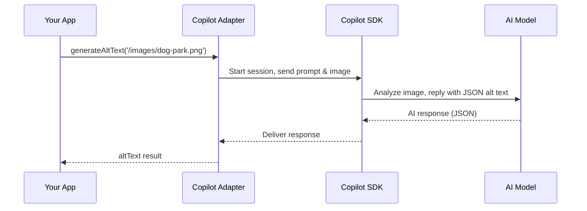

# Chapter 8: GitHub Copilot SDK Integration (`copilot-adapter.js`)

Welcome! In [Chapter 7: Job Processing & Queue (`job-queue.js`)](07_job_processing___queue___job_queue_js__.md), you learned how WP FotoKopilot batches up work on images—like a factory conveyor belt. Now:  
**How does FotoKopilot use AI to generate brilliant alt text and suggest smart folders for your images, automagically?**  
Let’s meet your friendly AI translator and consultant: **the GitHub Copilot SDK Integration (`copilot-adapter.js`).**

---

## Motivation: Why Connect Copilot AI Models to Your App?

**Central use case:**
> “I want my app to auto-generate alt text for images, and neatly suggest which folder each image should go in—using state-of-the-art AI (Copilot) that understands visual content.”

Sounds magic, right? The trick is bridging your app’s world (images, metadata, folders) with Copilot’s deep intelligence—so Copilot can analyze, recommend, and *reply in exactly the format your app needs*.  
**The Copilot Adapter (`copilot-adapter.js`) is your translator, consultant, and AI bridge!**

---

## Key Concepts: What Does the Copilot Adapter DO?

Let’s break this helpful “AI consultant” down into its jobs:

### 1. **Bridges Your App with Copilot’s AI Models**

It connects your app to the Copilot SDK—giving you access to powerful models for **text** and **image understanding**.

### 2. **Smart Prompt Building (Translator)**

It takes your images and their info (like filename, title, existing folders) and “translates” them into clear instructions and examples Copilot can understand—like “pretend you’re a web accessibility expert, and reply with JSON.”

### 3. **Tidy Results (Consultant)**

It makes sure Copilot only replies in a format your app can use:  
- Valid JSON for alt text  
- Valid folder suggestions  
- No unwanted chit-chat or AI disclaimers!

### 4. **Session and Error Management**

It handles AI session setup, events, and error recovery—keeping your app stable even if Copilot is busy, slow, or hiccups.

### 5. **Authentication and Server Settings**

It knows how to start/stop the Copilot server, connect to the right model, and check if you’re authenticated, all “behind the scenes.”

---

## How Does This Work in Practice? — Solving the Use Case

Imagine you want to auto-generate alt text for a photo called `dog-park.png`. Here’s how simple it is:

### 1. **Generate Alt Text for an Image**

```js
const result = await generateAltText('/images/dog-park.png')
// Output: { altText: "Three dogs playing fetch in a sunny park", valid: true, ... }
```

*Your image is sent to Copilot, which replies with a short, accessible alt text!*

---

### 2. **Suggest a Folder for an Image (With Existing Folders)**

Suppose you show Copilot your folders (“People”, “Events”, “Parks”) and an image with metadata.

```js
const res = await generateAltTextWithFolder(
  '/images/dog-park.png',
  [{ id: 1, path: 'Parks' }, { id: 2, path: 'Events' }],
  { metadata: { filename: 'dog-park.png', title: 'Dog Park Fun' } }
)
// Output: { folderPath: "Parks", action: "existing", ... }
```

*Copilot analyzes the image and its metadata, then suggests which folder to use—creating new ones only if it makes sense!*

---

### 3. **Check Copilot Status and Models**

```js
const status = await checkCopilotStatus()
// Output: { running: true, version: "1.2.4", ... }

const models = await listModels({ visionOnly: true })
// Output: [{ id: "gpt-4o", supportsVision: true }, ...]
```

*You can always check if Copilot is running and which models you can use!*

---

## Under the Hood: Step-by-Step Walkthrough

Let’s see how a simple “generate alt text” request flows.  
Imagine Copilot Adapter as your helpful assistant who does the heavy lifting:



- **You** request alt text for an image.
- **Adapter** starts a new AI session and builds a perfectly formatted prompt ("generate alt text, reply only as JSON, max 125 chars…").
- **Copilot** connects to the chosen AI model, sends the image and instructions.
- **Model** thinks, then replies with pure JSON only.
- **Adapter** parses, checks, and returns the result.

---

## Internal Implementation: Mini Code Samples

All logic lives in:  
`src/main/services/copilot-adapter.js`

### 1. **Starting and Initializing Copilot**

```js
import { CopilotClient } from '@github/copilot-sdk'

let client

async function initCopilot() {
  if (client) return
  client = new CopilotClient()
  await client.start()
}
```

*This connects to Copilot—so you can use AI features safely!*

---

### 2. **Generating Alt Text**

```js
export async function generateAltText(imagePath, options = {}) {
  await initCopilot()
  const session = await client.createSession({
    model: options.model || 'gpt-4o',
    systemMessage: { content: ALT_TEXT_SYSTEM_PROMPT, mode: 'append' },
  })

  try {
    const response = await session.sendAndWait({
      prompt: `Generate alt text for this image. Maximum length: 125 characters.`,
      attachments: [{ type: 'file', path: imagePath }],
    }, 60000)
    return parseAltText(response.data.content)
  } finally {
    await session.destroy()
  }
}
```

*Starts a session with Copilot, asks for alt text only, attaches your image, waits for response, and parses the answer!*

---

### 3. **Suggesting Folders**

```js
export async function generateAltTextWithFolder(imagePath, folders, options = {}) {
  await initCopilot()
  const session = await client.createSession({
    model: options.model || 'gpt-4o',
    systemMessage: { content: getFolderSystemPrompt('English'), mode: 'append' },
  })

  try {
    const prompt = buildFolderUserPrompt(options.metadata, folders, new Set())
    const response = await session.sendAndWait({
      prompt,
      attachments: [{ type: 'file', path: imagePath }],
    }, 30000)
    return parseFolderSuggestion(response.data.content)
  } finally {
    await session.destroy()
  }
}
```

*Copilot gets just the right context, then suggests smart, non-duplicate folders in exactly the format you want!*

---

### 4. **Catching and Handling Errors**

```js
session.on((event) => {
  if (event.type === 'session.error') {
    console.error("Session error:", event.data.message)
  }
})
```

*If Copilot gets confused or the AI returns an error, Adapter catches it and helps prevent crashes.*

---

## How Does Copilot Adapter Play with the Rest of Your App?

- **Job Queue:**  
  Used for batch jobs (like "Generate alt text for 100 images at once" from [Job Processing & Queue](07_job_processing___queue___job_queue_js__.md)).
- **Credential Storage and REST API:**  
  You can use Copilot’s suggestions directly to update your images or folders via [WordPress REST API Client (`wp-client.js`)](05_wordpress_rest_api_client___wp_client_js___.md).
- **Settings:**  
  Copilot Adapter respects user-chosen model and server options from [App Settings and State Management](03_app_settings_and_state_management_.md).
- **Error Handling and Status:**  
  Any errors or authentication problems are caught, logged, and passed up to your UI for safe recovery.

---

## Analogy Time: Your “AI Interpreter”

Picture Copilot Adapter as a super-skilled interpreter between your world of images and Copilot’s AI:

- It listens to your requirements (“I need alt text, make it for screen readers only!”)
- It translates everything into Copilot’s language—with crystal-clear instructions and examples.
- It hands you back the answer—only the info you need, no extra fluff.

---

## Conclusion & Next Steps

You’ve learned:
- **Why** connecting to Copilot models lets your app generate smart alt text and folder suggestions for ANY image—even in bulk!
- **How** Copilot Adapter acts as a bridge, prompt builder, error handler, and format consultant between your app and Copilot’s SDK.
- **How to use** simple code to get results: alt text, folder info, model lists, and status.
- **How Copilot Adapter fits** with job queues, credential storage, REST API, and app settings for seamless smart features.

Next up, let’s boost performance

---

Generated by [AI Codebase Knowledge Builder](https://github.com/The-Pocket/Tutorial-Codebase-Knowledge)