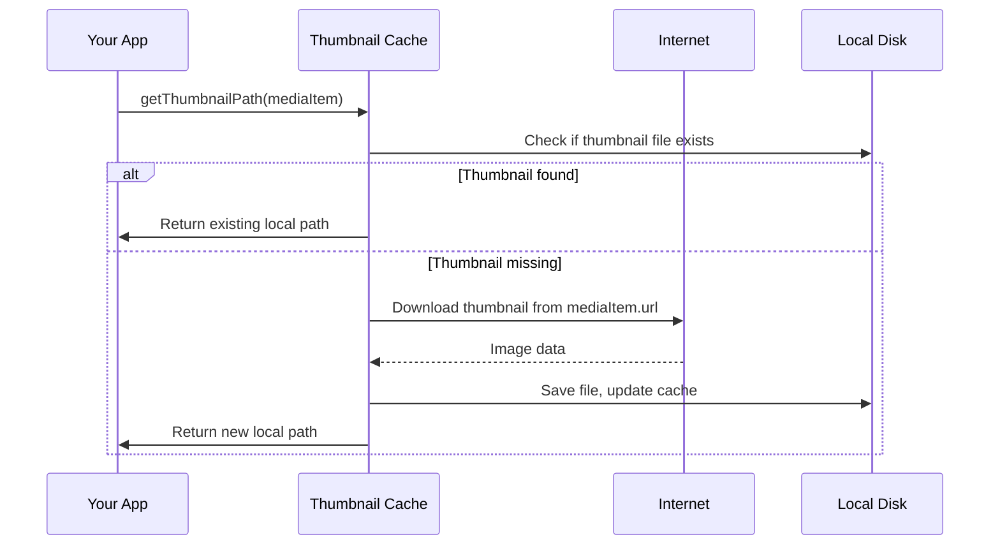

# Chapter 9: Thumbnail Caching (`thumbnail-cache.js`)

*Picking up from [Chapter 8: GitHub Copilot SDK Integration (`copilot-adapter.js`)](08_github_copilot_sdk_integration___copilot_adapter_js__.md):*  
In the previous chapter, you discovered how FotoKopilot uses smart AI (Copilot) to analyze and generate alt text or suggest folders for your images. But before an image can be analyzed quickly---especially by Copilot---it’s best to keep a **local copy of its thumbnail** handy. Enter: **Thumbnail Caching!**

---

## Motivation: Why Does Thumbnail Caching Matter?

**Central Use Case:**  
*"I want to generate alt text or analyze lots of images from my WordPress library, but I don’t want to repeatedly download big image files off the internet, every time the AI or dashboard needs a thumbnail!"*

Photographers and content creators often work with hundreds (or thousands!) of images. Downloading the same thumbnails over and over would waste time, bandwidth, and computer speed. What if you could keep just the “freshest” and most popular thumbnails locally, and toss out the older ones to free up space?

That's exactly what `thumbnail-cache.js` does.  
Think of it as your image **mini-fridge**: you keep only what you need on hand, and rotate out the oldest leftovers!

---

## Key Concepts: The Thumbnail Cache, One Step at a Time

Let’s break it down as simply as possible:

### 1. **Local Cache Directory**

The cache is just a special folder on your computer (like your “mini-fridge” for images). All downloaded thumbnails are saved here.

### 2. **Download-on-Demand**

When the app (or Copilot) needs a thumbnail, it checks your cache first.  
- **If it’s there:** Use it instantly—no internet delay!
- **If it’s missing:** Download it, store it in the cache for future use.

### 3. **LRU Eviction ("Least Recently Used")**

The cache doesn’t grow forever!  
FotoKopilot throws out the **stale** or least-used thumbnails (“last week’s leftovers”) if the fridge gets too full---making space for new images.

### 4. **File Naming & Fast Lookup**

Each thumbnail is saved with a unique, short hash---so finding or deleting a file is easy and fast.

---

## How to Use Thumbnail Caching

Let’s see a simple, real-world example. Say you want a local file path for a thumbnail (to show in the UI or analyze with Copilot):

### Get or Download a Thumbnail

```js
const path = await getThumbnailPath(mediaItem)
// path: '/tmp/wp-fotokopilot-cache/7a1e32c4bc8bdb7c.jpg'
```

**Input:**  
- `mediaItem` is an object from the WordPress API with an image URL (e.g., from a scan).

**Output:**  
- Returns a string file path to the thumbnail, always local!
- If it’s already cached, you get it instantly. If not, it’s downloaded and saved before returning.

> Use this path for showing thumbnails, passing to the Copilot Adapter, etc.

---

## What Happens Under the Hood? (Step-By-Step)

Here’s what happens when you call `getThumbnailPath`:



- The thumbnail cache checks its folder (“fridge”).
- If the image is already there, it returns it instantly.
- If not, it fetches the image, saves it, then hands you the fresh file.
- The cache quietly manages which files to keep or toss, so you don’t worry about space.

---

## Exploring the Code (Beginner-Friendly Chunks)

Let’s peek at the key building blocks in `src/main/services/thumbnail-cache.js`.

### 1. **Set Up the Cache Folder**

```js
const CACHE_DIR = ... // a temp folder like /tmp/wp-fotokopilot-cache

// Make sure the folder exists
await mkdir(CACHE_DIR, { recursive: true })
```

**What this does:**  
Makes sure your computer has a safe folder to store thumbnails.  
*(You never have to pick the location—it’s handled for you!)*

---

### 2. **Get (or Download) a Thumbnail**

```js
export async function getThumbnailPath(mediaItem) {
  // Figure out the URL to fetch
  const url = mediaItem.thumbnailUrl || mediaItem.sourceUrl
  // Make a short hash for the filename
  const hash = createHash('sha256').update(url).digest('hex').slice(0, 16)
  // Set the local file path
  const localPath = join(CACHE_DIR, `${hash}.jpg`)

  // If already on disk, update "last used" and return it
  try {
    await stat(localPath)
    lruOrder.set(hash, Date.now())
    return localPath
  } catch {
    // Otherwise, download and save the file
    const response = await fetch(url)
    await pipeline(response.body, createWriteStream(localPath))
    lruOrder.set(hash, Date.now())
    await evictIfNeeded()
    return localPath
  }
}
```

**Key points:**  
- Makes a unique file name (using a hash of the URL).
- If file is present, just updates its "last used" time.
- Otherwise, downloads it, saves it, and updates the cache.
- Always returns a reliable **local file path**.

---

### 3. **Evict Old Thumbnails if Cache Is Full**

```js
async function evictIfNeeded() {
  // Calculate total cache size
  // If too big, sort files by "last used", then delete the oldest
  // Stop deleting once enough space is freed
}
```

**What this does:**  
- Checks if your “fridge” is overflowing (using a 500 MB limit).
- If too full, removes older (less-used) thumbnails first.
- Keeps enough “room” for lots of fresh images, but never runs out of space.

---

### 4. **Clearing the Whole Cache**

If you ever want to clean out all thumbnails (for privacy or space):

```js
export async function clearCache() {
  // Remove all cached files
  // Erase the LRU tracking info
}
```

**Result:**  
Cache folder is now empty and will start fresh!

---

## Where is Thumbnail Caching Used?

- **Copilot Adapter:**  
  AI models work much faster with local thumbnails—see [GitHub Copilot SDK Integration (`copilot-adapter.js`)](08_github_copilot_sdk_integration___copilot_adapter_js__.md).
- **Scan & Job Queue:**  
  Any batch process that analyzes images can use this cache for instant thumbnail access—see [Job Processing & Queue (`job-queue.js`)](07_job_processing___queue___job_queue_js__.md).
- **Live UI:**  
  Displaying media previews is much faster when you don’t need to wait for the network.

---

## Analogy Recap: Your Image "Mini-Fridge"

Imagine you’re a chef:
- Your "mini-fridge" (the cache) only holds this week’s most-used ingredients (thumbnails).
- When you need something, you check the fridge first.
- If it’s missing, you run to the store (internet!), grab it, and stock the fridge.
- If the fridge is full, you throw out the *least used* items to make space.

**Result:**  
You always have the freshest, fastest ingredients (thumbnails) for your next "meal" (AI job or dashboard view)---with no waste or clutter!

---

## Summary and What’s Next?

In this chapter, you’ve learned:
- Why Thumbnail Caching is crucial for speed, bandwidth, and performance when working with large libraries.
- How it saves, retrieves, and (if needed) deletes image thumbnails---all on its own.
- How space is managed with a "least recently used" (LRU) system---so your local cache is always fresh.
- Where this mini-fridge fits into the bigger FotoKopilot architecture: Copilot, job queue, and the dashboard UI.

**Ready for the next step?** In the following chapter, you’ll learn how FotoKopilot validates your input and keeps things safe with handy [Validation Utilities (`validation.js`)](10_validation_utilities___validation_js___.md).

---

---

Generated by [AI Codebase Knowledge Builder](https://github.com/The-Pocket/Tutorial-Codebase-Knowledge)