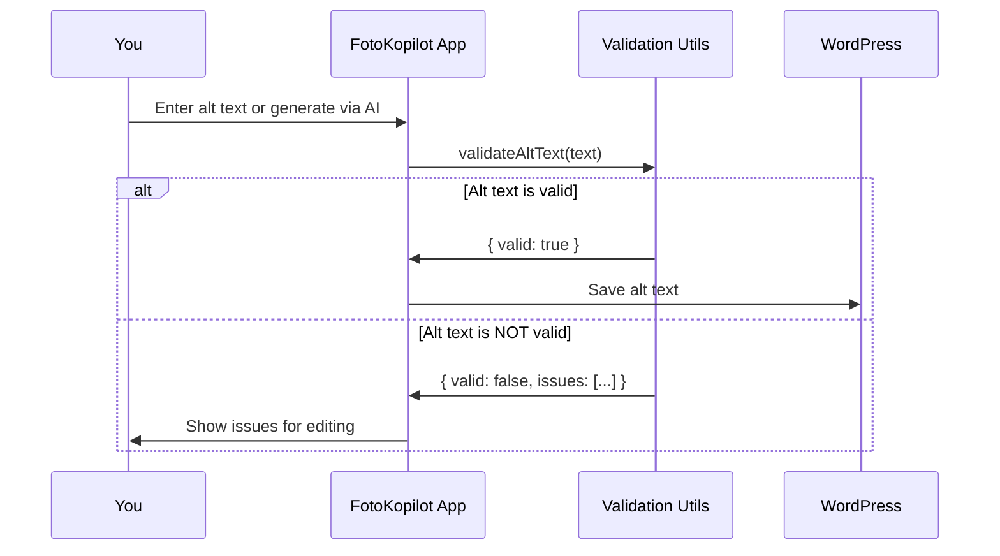

# Chapter 10: Validation Utilities (`validation.js`)

*Coming from [Chapter 9: Thumbnail Caching (`thumbnail-cache.js`)](09_thumbnail_caching___thumbnail_cache_js__.md):*  
You just learned how WP FotoKopilot keeps everything speedy and efficient by caching image thumbnails.  
Now, let's talk about something equally important: **making sure every bit of alt text you add is safe, meaningful, and accessible!**  
Meet your friendly bouncer at the club door: the **Validation Utilities (`validation.js`)**.

---

## Why Alt Text Validation Is So Important (Motivation)

**Central Use Case:**  
> "I want to make sure every alt text I create or auto-generate is truly helpful for all users, especially those using screen readers. I don't want to accidentally include a filename, mention AI, or stuff in forbidden phrases."

**Alt text** helps everyone understand images, even if they can't see them. But if you put the wrong stuff in there—like "photo of", "dog1234.jpg", or "Generated by AI"—it hurts accessibility and even your search results!

The validation system checks every alt text before it goes out, so only *friendly, accessible* descriptions make it through.

---

## Key Concepts, Broken Down Simply

Let's think of validation like a club bouncer checking each guest (your alt text!) for these rules:

### 1. **Forbidden Phrases & Prefixes**

Certain beginnings like "image of..." are *always* unwelcome—they add nothing for users with screen readers.

### 2. **No Filenames or Extensions**

Stuff like "DSC_10023.jpg" isn’t alt text—it’s a file label.

### 3. **No Mention of AI**

If your alt text says, "Generated by AI" or "ChatGPT", it's not helpful for real people!

### 4. **No Keyword Stuffing or Repetition**

Alt text should feel natural, not packed with repeated words.

### 5. **Must Be the Right Length and Type**

Stick to 125 characters max, and use normal sentences (not random types or empty data).

---

## How to Use Validation Utilities: The Simple Way

Whenever you want to check an alt text, just use `validateAltText` to see if it's allowed:

### Example 1: Validate Plain, Good Alt Text

```js
const result = validateAltText('A dog jumping over a log.')
// result.valid: true
// result.issues: []
```

*This description is friendly and accessible—validation says YES!*

---

### Example 2: Catch a Forbidden Prefix and Filename

```js
const result = validateAltText('Photo of DSC_0045.jpg')
// result.valid: false
// result.issues: ['Starts with forbidden prefix: "photo of"', 'Contains file extension']
```

*This is *not* helpful for users, so the validator blocks it and tells you why.*

---

### Example 3: Block AI Mentions

```js
const result = validateAltText('Generated by AI: a sunset.')
// result.valid: false
// result.issues: ['Contains AI mention']
```

*No one wants to read "Generated by AI"! This won't get through.*

---

### Example 4: Trim and Fix Overly Long Text

```js
const result = validateAltText('An extremely long description that... (keeps going)')
// result.valid: false  (if over 125 characters)
// result.issues: ['Exceeds 125 characters (150)']
```

*Stick to the limit for best accessibility.*

---

### Example 5: Sanitize Alt Text

Want to "clean up" a messy alt text (e.g., remove forbidden prefixes, add proper formatting)? Use `sanitizeAltText`:

```js
const safe = sanitizeAltText('Picture of: lovely kittens in a basket')
// safe: 'Lovely kittens in a basket'
```

*It removes the bad bits and even fixes the capitalization!*

---

## What Happens Internally? (Visual Walkthrough)

Let's see the validation flow from the moment you suggest an alt text to what happens under the hood:



- The validator acts BEFORE anything is saved or sent out—so you always stay within best practices!

---

## Exploring the Code: Beginner-Friendly Chunks

The magic happens in:  
**`src/main/utils/validation.js`**

Let's walk through the main parts.

---

### 1. **List of Forbidden Prefixes**

```js
const FORBIDDEN_PREFIXES = [
  'image of', 'picture of', 'photo of', 'photograph of',
  'a image', 'an image', 'a photo', /* ...and more */
]
```

*If your alt text starts with any of these, it's a no-go!*

---

### 2. **The `validateAltText` Function**

```js
export function validateAltText(text, maxLength = 125) {
  const issues = []
  // (1) Check missing or wrong type
  // (2) Trim and check length
  // (3) Scan for forbidden prefixes
  // (4) Look for file extensions, AI mentions, keyword stuffing...
  // Return validity + issue list.
}
```

- **Input:** Your alt text and an optional max length (defaults to 125).
- **Output:** An object like `{ valid, issues, text }`.

*It collects all the things that would block your alt text, then hands you a detailed report.*

---

### 3. **The `sanitizeAltText` Function**

```js
export function sanitizeAltText(text, maxLength = 125) {
  // Remove forbidden prefixes (if present)
  // Capitalize first letter
  // Cut off if too long (and add "…")
  return sanitized
}
```

- **Input:** The raw (possibly messy) alt text.
- **Output:** A "cleaned up" string you can safely use.

*It makes a best effort to fix little mistakes automatically!*

---

## Advanced Features: What Exactly Gets Flagged?

**A few of the things `validateAltText` will catch:**
- **"Photo of a cat.jpg"** → Blocks "photo of" prefix *and* filename.
- **"Generated by AI, dogs at beach"** → Blocks AI mention.
- **"Beach Beach Beach Beach"** → Flags as "Possible keyword stuffing".
- **"A lighthouse and blue sky"** → Passes with flying colors!

The validator even counts repeated words (overuse), and makes sure there are no hidden filenames or file extensions.

---

## How Does Validation Fit into the Rest of FotoKopilot?

- **Job Queue:**  
  Every alt text—whether batch or single—is checked before being submitted ([Job Processing & Queue (`job-queue.js`)](07_job_processing___queue___job_queue_js__.md)).

- **Copilot Integration:**  
  Even fancy AI-generated text from [GitHub Copilot SDK Integration (`copilot-adapter.js`)](08_github_copilot_sdk_integration___copilot_adapter_js__.md) must pass these checks!

- **WordPress API:**  
  Only validated, sanitized alt texts are sent to your live WordPress site ([WordPress REST API Client (`wp-client.js`)](05_wordpress_rest_api_client___wp_client_js___.md)).

- **UI Feedback:**  
  If something doesn't pass, the app tells you what to fix, so you can get accessibility right every time.

---

## Analogy: The Club Bouncer

Imagine each suggested alt text as a club guest:
- **The bouncer (validator)** checks IDs (starts right), clothing (no forbidden text!), and keeps out any troublemakers (AI mentions or filenames).
- Only well-behaved, helpful guests (alt texts) get to join the party (WordPress)!

---

## Conclusion

In this chapter, you learned:
- Why validating alt text makes everyone’s web experience better—especially for those using screen readers.
- The main rules: no forbidden phrases, no AI mentions, no filenames, and no keyword stuffing!
- How to use FotoKopilot’s validation system to **check** and **sanitize** your alt descriptions before updating WordPress.
- How validation keeps your batch jobs, Copilot results, and user edits safe and accessible.
- Where validation fits into the whole FotoKopilot architecture as a key quality checkpoint.

Congrats! You now have the power to create, check, and fix alt texts with confidence.

---

There are no further chapters—feel free to revisit any [previous topics](01_react_electron_hooks_and_integration_.md) to explore how everything comes together. Happy (accessible) publishing!

---

Generated by [AI Codebase Knowledge Builder](https://github.com/The-Pocket/Tutorial-Codebase-Knowledge)