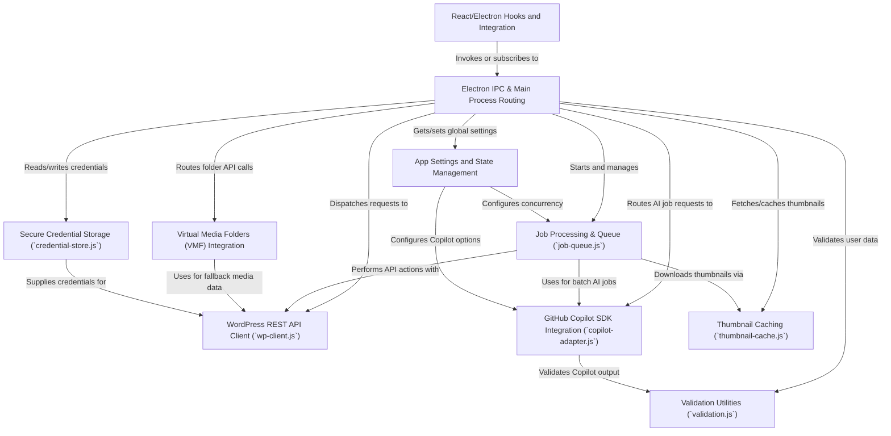

# Tutorial: wp-fotokopilot

**WP FotoKopilot** is a desktop app that helps users quickly manage image alt text and folders on their WordPress sites for better accessibility and organization.  
It connects your computer to WordPress, letting you *scan* your media library, *batch-generate smart alt text* using **GitHub Copilot AI**, and organize images into *virtual folders* with ease.  
Everything happens securely inside a friendly UI, keeping your sensitive info safe and letting you automate repetitive media tasks with a few clicks.

**Source Repository:** [https://github.com/soderlind/wp-fotokopilot](https://github.com/soderlind/wp-fotokopilot)

## Chapters

1. [React/Electron Hooks and Integration
](01_react_electron_hooks_and_integration_.md)
2. [Electron IPC & Main Process Routing
](02_electron_ipc___main_process_routing_.md)
3. [App Settings and State Management
](03_app_settings_and_state_management_.md)
4. [Secure Credential Storage (`credential-store.js`)
](04_secure_credential_storage___credential_store_js___.md)
5. [WordPress REST API Client (`wp-client.js`)
](05_wordpress_rest_api_client___wp_client_js___.md)
6. [Virtual Media Folders (VMF) Integration
](06_virtual_media_folders__vmf__integration_.md)
7. [Job Processing & Queue (`job-queue.js`)
](07_job_processing___queue___job_queue_js___.md)
8. [GitHub Copilot SDK Integration (`copilot-adapter.js`)
](08_github_copilot_sdk_integration___copilot_adapter_js___.md)
9. [Thumbnail Caching (`thumbnail-cache.js`)
](09_thumbnail_caching___thumbnail_cache_js___.md)
10. [Validation Utilities (`validation.js`)
](10_validation_utilities___validation_js___.md)

---

Generated by [AI Codebase Knowledge Builder](https://github.com/The-Pocket/Tutorial-Codebase-Knowledge)